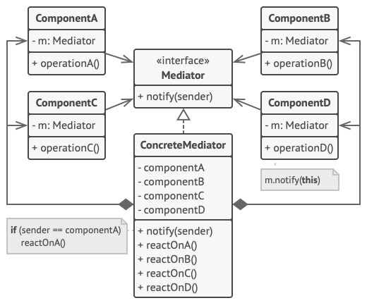

# Mediator

## Prerequisite

This documents assume that
 - You have basic knowledge of c#
 - You know how to read class diagram

&nbsp;
## 1. Intent

Define an object that encapsulates how a set of objects interact. Mediator promotes loose coupling by keeping objects from referring to each other explicitly, and it lets you vary their interaction independently.<sup>a)</sup>

&nbsp;
## 2. Structure
#### Class diagram
\
https://refactoring.guru/design-patterns/mediator<sup>b)</sup>


&nbsp;
## 3. Participants
- `Components`
    - Components are various classes that contain some business logic. Each component has a reference to a mediator, declared with the type of the mediator interface. The component isn’t aware of the actual class of the mediator, so you can reuse the component in other programs by linking it to a different mediator.
- `Mediator`
    - The Mediator interface declares methods of communication with components, which usually include just a single notification method. Components may pass any context as arguments of this method, including their own objects, but only in such a way that no coupling occurs between a receiving component and the sender’s class.
- `Concrete Mediators`
    - Concrete Mediators encapsulate relations between various components. Concrete mediators often keep references to all components they manage and sometimes even manage their lifecycle.
- `Components`
    - Components must not be aware of other components. If something important happens within or to a component, it must only notify the mediator. When the mediator receives the notification, it can easily identify the sender, which might be just enough to decide what component should be triggered in return.
    - From a component’s perspective, it all looks like a total black box. The sender doesn’t know who’ll end up handling its request, and the receiver doesn’t know who sent the request in the first place.

https://refactoring.guru/design-patterns/mediator<sup>c)</sup>


&nbsp;
## 4. Sample Code 
`Mediator`
```c#
using System;

namespace RefactoringGuru.DesignPatterns.Mediator.Conceptual
{
    // The Mediator interface declares a method used by components to notify the
    // mediator about various events. The Mediator may react to these events and
    // pass the execution to other components.
    public interface IMediator
    {
        void Notify(object sender, string ev);
    }

    // Concrete Mediators implement cooperative behavior by coordinating several
    // components.
    class ConcreteMediator : IMediator
    {
        private Component1 _component1;

        private Component2 _component2;

        public ConcreteMediator(Component1 component1, Component2 component2)
        {
            this._component1 = component1;
            this._component1.SetMediator(this);
            this._component2 = component2;
            this._component2.SetMediator(this);
        } 

        public void Notify(object sender, string ev)
        {
            if (ev == "A")
            {
                Console.WriteLine("Mediator reacts on A and triggers folowing operations:");
                this._component2.DoC();
            }
            if (ev == "D")
            {
                Console.WriteLine("Mediator reacts on D and triggers following operations:");
                this._component1.DoB();
                this._component2.DoC();
            }
        }
    }

    // The Base Component provides the basic functionality of storing a
    // mediator's instance inside component objects.
    class BaseComponent
    {
        protected IMediator _mediator;

        public BaseComponent(IMediator mediator = null)
        {
            this._mediator = mediator;
        }

        public void SetMediator(IMediator mediator)
        {
            this._mediator = mediator;
        }
    }

    // Concrete Components implement various functionality. They don't depend on
    // other components. They also don't depend on any concrete mediator
    // classes.
    class Component1 : BaseComponent
    {
        public void DoA()
        {
            Console.WriteLine("Component 1 does A.");

            this._mediator.Notify(this, "A");
        }

        public void DoB()
        {
            Console.WriteLine("Component 1 does B.");

            this._mediator.Notify(this, "B");
        }
    }

    class Component2 : BaseComponent
    {
        public void DoC()
        {
            Console.WriteLine("Component 2 does C.");

            this._mediator.Notify(this, "C");
        }

        public void DoD()
        {
            Console.WriteLine("Component 2 does D.");

            this._mediator.Notify(this, "D");
        }
    }
    
    class Program
    {
        static void Main(string[] args)
        {
            // The client code.
            Component1 component1 = new Component1();
            Component2 component2 = new Component2();
            new ConcreteMediator(component1, component2);

            Console.WriteLine("Client triggets operation A.");
            component1.DoA();

            Console.WriteLine();

            Console.WriteLine("Client triggers operation D.");
            component2.DoD();
        }
    }
}
```
Output
```
Client triggers operation A.
Component 1 does A.
Mediator reacts on A and triggers following operations:
Component 2 does C.

Client triggers operation D.
Component 2 does D.
Mediator reacts on D and triggers following operations:
Component 1 does B.
Component 2 does C.
```
https://refactoring.guru/design-patterns/mediator/csharp/example#example-0<sup>d)</sup>

&nbsp;
## 5. Pros and Cons
### Pros 👍
- You can reduce coupling between various components of a program.
- You can reuse individual components more easily.

### Cons 👎
- Mediator class can be very complex.
- Hard to reuse in other applications.

&nbsp;
## 6. References
#### a) Erich Gamma, Richard Helm, Ralph Johnson, John Vlissides, _Design Patterns - Elements of Reusable Object-Oriented Software_ (Addison-Wesley, 1994), 273
#### b), c) https://refactoring.guru/design-patterns/mediator
#### d) https://refactoring.guru/design-patterns/mediator/csharp/example#example-0
