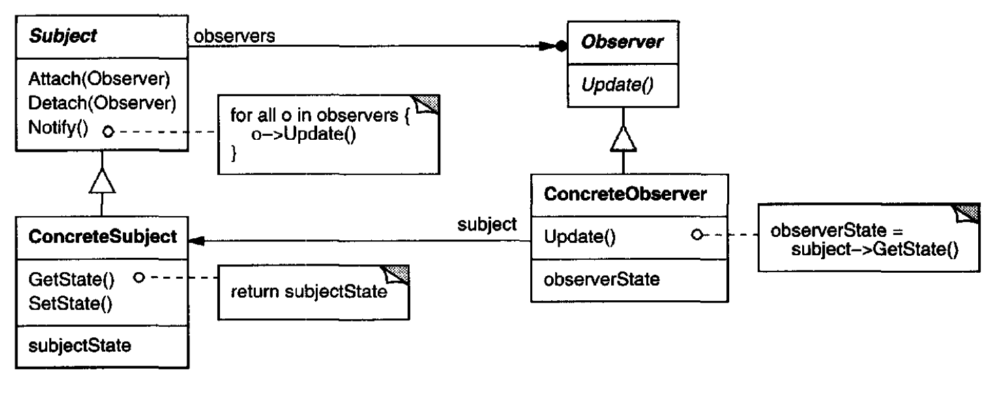

# Observer Pattern

### 1. What is Observer pattern
- When an object(`subject`) changes its state, all its dependents(`observers`) are notified and updated

### 2. Why do we need Observer pattern (what problems can be solved)
We want to ensure that
- a one-to-many dependency between objects is defined without making the objects tightly coupled
- an open-ended number of dependents are notified an object's state changes and updated upon the changes

### 3. Class diagram & Sequence diagram
#### `Class diagram`


#### `Participants`
- **Subject**
  - provides an interface to maintain a list of observers and notify the observers of state changes
- **Observer**
  - provides an interface to be notified of subject's changes and updated upon the changes
- **ConcreteSubject**
  - maintains a list of observers
  - notifies the observers of state changes
- **ConcreteObserver**
  - maintains a reference to a ConcreteSubject object
  - register itself on a subject
  - update its state when they are notified

#### `Sequence diagram`


### 4. Sample code
```java
/*
  https://www.tutorialspoint.com/design_pattern/observer_pattern.htm
*/

// Subject
public class Subject {

    private List<Observer> observers = new ArrayList<>();
    private int state;

    public int getState() {
        return state;
    }

    public void setState(int state) {
        this.state = state;
        notifyAllObservers();
    }

    public void attach(Observer observer){
        observers.add(observer);
    }

    public void notifyAllObservers(){
        for (Observer observer : observers) {
            observer.update();
        }
    }
}

// Observer abstract class
public abstract class Observer {
    protected Subject subject; // optional, can be explicitly referenced
    abstract void update();
}

// ConcreteObserver 1
public class BinaryObserver extends Observer {

    public BinaryObserver(Subject subject) {
        this.subject = subject;
        subject.attach(this);
    }

    @Override
    void update() {
        System.out.println( "Binary String: " + Integer.toBinaryString(subject.getState()));
    }
}

// ConcreteObserver 2
public class OctalObserver extends Observer {

    public OctalObserver(Subject subject){
        this.subject = subject;
        this.subject.attach(this);
    }

    @Override
    public void update() {
        System.out.println( "Octal String: " + Integer.toOctalString(subject.getState()));
    }
}

// ConcreteObserver 3
public class HexObserver extends Observer{

    public HexObserver(Subject subject){
        this.subject = subject;
        this.subject.attach(this);
    }

    @Override
    public void update() {
        System.out.println( "Hex String: " + Integer.toHexString( subject.getState()).toUpperCase());
    }
}

// Client
public class Client {
    public static void main(String[] args) {
        Subject subject = new Subject();

        new HexObserver(subject);
        new OctalObserver(subject);
        new BinaryObserver(subject);

        // observers can be explicitly attached
        // subject.attach(new HexObserver());
        // subject.attach(new OctalObserver());
        // subject.attach(new BinaryObserver());

        System.out.println("First state change: 15");
        subject.setState(15);
        System.out.println();
        System.out.println("Second state change: 10");
        subject.setState(10);
    }
}
```

### 5. Advantages and disadvantages

`Advantages`
- **Decouples subject from observers**: Subject only refers to and knows about the Observer interface for updating its state

- **Makes adding/removing observers easy**: Observers can be added and removed from a subject independently and dynamically because themselves are responsible for registering and un-registering on a subject

`Disadvantages`
- **A change on the subject may cause a cascade of updates to observers**: It may repeatedly update observers when there is a series of state changes. If the pattern is poorly designed and the cost of these updates is high, it may be an issue
- **Lapsed listener problem**: When an observer fails to unsubscribe from the subject, the memory leak happens because subject still holds a reference to the observer which prevents it from being garbage collected (Java, C#, other languages in which GC automatically performs)

### 6. Differences from other patterns

`Mediator` 
- encapsulates how a set of objects interact each other so that the objects are not required to have each other's explicit dependencies
- colleagues communicates with Mediator when an event of interests occurs

`Publisher-subscriber`
- publishers can publish an event without knowing who the subscribers are as they communicate through an event channel

`Command`
- encapsulates a set of requests(actions)


### 7. References
[Observer, w3sDesign](http://w3sdesign.com/?gr=b07&ugr=proble#gf)
[Observer pattern, wikipedia](https://en.wikipedia.org/wiki/Observer_pattern)